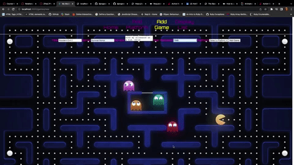
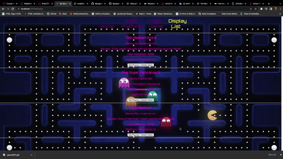
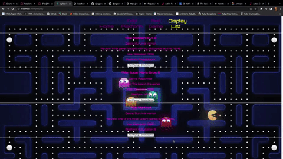

# Getting Started with Game Lister

This project was bootstrapped with [Create React App](https://github.com/facebook/create-react-app).

## Functionality

This project is mainly focuse on the back end using a combo of Avtive Record, Ruby and Sinatra to build an API where request/response works flawlessly with React components.

One-to-many relationship between Gaming Platforms and Games.
Platforms have many games and games belong to platforms.

Platforms has GET/POST functionality.
Games is full CRUD.

React code is minimal and simple, my focus was to build an API and have it interact with React, such as request/response flow for CRUD methods and table relations.

### Home Page

This is the default page where the journey begins with basic instructions on how the app works.

### Add Platform

Since the Platform table is the parent(has many games). We add the platform if not already listed, once added it will redirect you to the Add Game component in which the dropdown menu will be automatically updated with your newly added platform thanks to the Primary key in the Platform table and the Foreign key in the Games table which is what holds the relationship together.

This is where I implement GET/POST in the action platforms_controller.

### Add Game

Here we have another form with several inputs to fill out in order to add the game. Inputs include Title, Genre, Review, Year Released and finally the dropdown option where added Platforms will be displayed in order to relate any given platoform to the newly added game.

Once the "Add Game" button is clicked it will add the game with it's related platform and redirect you to the Display Games component.

This is where I implement POST request in which the games_controller is responsible for producing the correct output displayed in Display Games component.

### Display Games

Here is where you will see your games displayed and will have the option to switch between currently playing to not problem which is a boolean value that will change in the backend from true to false and vice versa.

You will also Have the option to delete the game from your collection if so desired.

This is where I implement GET/PATCH/DELETE in the games_controller while fetching it from the front end so changes are consistent in both cases.

CHANGE PLAYING STATUS:

DELETE GAME FROM DATABASE:

## THANK YOU FOR STOPPING BY!

That's it! pretty simple on a surface level but I learned so much about models, table relationships and request/response flow.

# react-frontend
